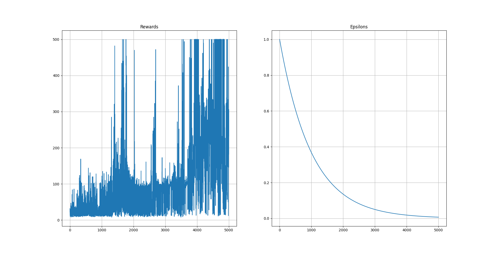
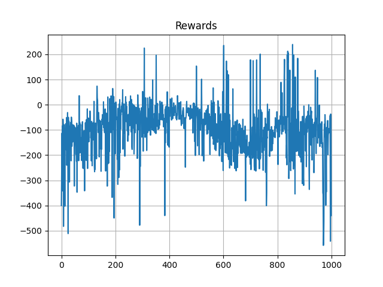

# D2QN


Implementation of Double DQN with Pytorch.

in case if you understand persian and wanna find out more, checkout my [Virgool](https://vrgl.ir/hEp6b
) post :D

## Installation

clone project with:

```bash
git clone git@github.com:mhyrzt/D2QN.git
```

for training D2QN run following command in terminal:

```bash
python trainer.py
```

for running a simulation with trained ANN:

```bash
python play.py
```

## Modules/Classes

### ``History``

for storing, plotting & logging history of rewards and epsilon.

#### Methods

- ``add`` → for adding new values for reward and epsilon
- ``log`` →for logging last reward and episode from arrays.
- ``plot``→ for plotting epsilon and reward arrays

### ``Epsilon``

the main purpose of this class is to implement _Epsilon-Greedy_ for exploration and exploitation. it takes two arguments:

1. gym environment: for taking random action.
2. torch ANN model: to predict best action.

```python
epsilon = Epsilon(env, model)
```

#### Methods

- ``_rand``→ this method generate a random floating number in range of 0 and 1.

- ``get_action``→ predict best action based on ANN model.

- ``take_action``→ based on random number return a random action or the best action from model.

- ``decrease``→decrease amount of epsilon by multiplying it with a constant.

### ``ReplyBuffer``

for storing info and stats of each step also known as experience:

- Current State
- Action
- Reward
- Next State
- Is Terminal (done)

as arguments it takes two number:

1. max_len → maximum number of experience to store.

2. batch_size → number of experience for random sampling.

```python
buffer = ReplyBuffer(5_000, 128)
```

#### Methods

- ``add`` → sotre a new experience.
- ``sample`` → random sampling with ``self.batch_size``
- ``can_sample`` → check if sampling is possible or not.

### ``Model``

in progress...

#### Methods

in progress...

### ``Agent``

in progress...

#### Methods

in progress...

## Results

### CartPole-v1



### LunarLander-v2


